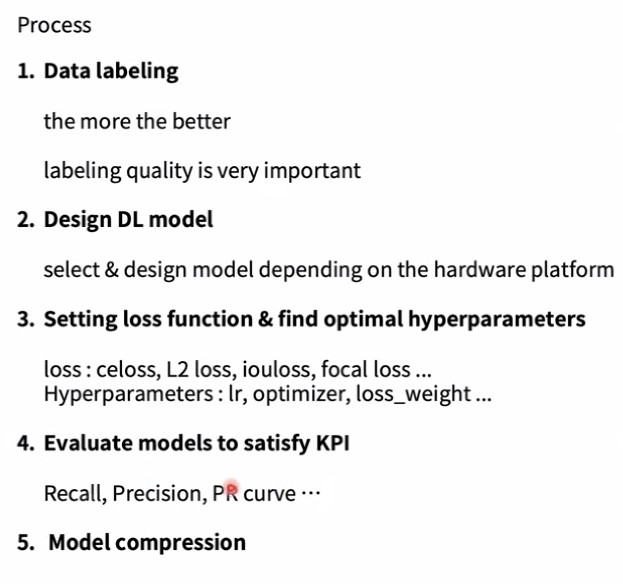
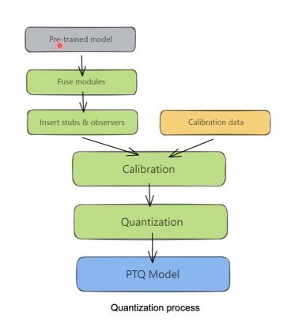

# PerCeption DL process


## Data Lableing
1. 레이블링 정확도가 성능에 큰 영향을 준다. 
2. Labeling Policy 기준을 직접 세울 수 있을 만한 딥러닝 & 컴퓨터 비전 지식이 필요하다.
3. 데이터 수는 많으면 많을 수록 좋다.
4. 데이터 내에 클래스별 비율도 성능에 영향을 준다.
5. Long tail problem
    + 적은 수의 클래스 데이터를 늘리는 방법?
      + 데이터 관점
        + Offline: 학습 데이터에서 늘리는 방법
          + tail image augmentation
        + Online: 모델 학습 시 적은 클래스 데이터를 증가
      + 모델 관점
        + Loss에서 적은 양의 클래스가 더 반영하는 방법
          + softmax, cross-entorpy를 일반적으로 사용
          + loss를 수정하여 Long-tail problem을 해결할 수 있다. 
          + focal loss

> Edge Case(예외사항)이 존재할 수 있기 떄문에 레이블링 정책 기준을 직접 세울 수 있어야한다. 

## Design DL model
+ one stage/two stage 관점
+ backbone 구성
+ 하드웨어 플랫폼에 따라 모델을 선택하고 디자인하는 것이 중요
+ KPI

## Setting loss function
+ class loss
  + cross_entorpy
  + softmax loss
  + focal loss 
  + ...
+ Box loss
  + IOU loss
  + CIOU loss
+ Hyperparameter:
  + lr
  + scheduler
  + weight decay
  + loss weight(각 항목에 대한 loss weight를 넣을 수 있다.)

## Evaluate models to satisfy KPI

**정량적 성능**
+ Recall
+ Precision
+ PR curve
+ confusiion matrix

**정성적 성능**
시각적으로 모델의 성능을 평가

> PR Curve를 확인하는 것이 중요

# Model Compression
> SOC Computing Power는 일반적인 PC에서 학습하던 Computing power에 비해 약하다.

1. Light architecture
2. Pruning
   + DropOut은 Inference과정에서만 weight값이 0이 되는 데 실제 나중 모델 구성에서 지워지지 않는다고 생각하면 좋다.
3. Quantization
   + 
4. BatchNorm folding
   + Conv 계층에 합쳐버리는 것

## Light Architeture
> MAC이라는 수치를 보고 기준을 세울 수 있음

Reduce MAC
+ Smaller kernel size
  + MAC 관점에서 kernel size를 줄이는 것도 방법
+ Resolution Scaling
  + Input Size를 줄이는 것
+ Depth Scaling
  + The number of layers
  + Shallow한 model
+ Width scaling
  + Channel of each layer
  + Output channel의 수를 조절해주는 것이 좋다.

## Pruning
실험적으로 모델의 각각의 weight를 보고 가지치기하는 것
> 덜 중요한 파라미터를 지우는 것이 목적이다. 

+ Trade off가 있다.
  + 정확도
  + 연산량
+ Device 자체적으로 지원해주는 경우가 있음

## Quantizaiton

Precision 조정을 통해 Lower bit를 연산하는 것

> 32비트 부동소수점을 8비트 정수값으로 변환하는 과정
 
+ Calibration: 통계적으로 이미지 여러개를 잡고 optimal Quantized range를 구하는 것

## BatchNorm folding
CONV와 BN의 연산을 합치는 것
// 수식 이미지 넣기

## Depoly model
모델을 배포할 때 pytorch model은 배포할 수 없음
+ 최대한 하드웨어에 최적화를 해야한다.
+ **ONNX**, **TensorRT**, platform DL accelerator SDK, navie C/C++, ...etc..

### ONNX
Open Neural Network Exchange
+ 적재하기 좋도록 바꿔주는 주유소, 휴게소같은 개념이다.

> onnx.ai

**Operator**
기본적인 연산자들을 의미한다. 
+ CONV에서 이용하는 기본적인 연산자를 제곻한다.

> 모델을 작성할 때 지원해주는 ONNX Operator를 사용하는 것이 중요하다.

```python
import torch
torch.onnx.export() # export를 이용하면 가능
```

### TensorRT
NVIDIA에서 지원하는 SDK TOOL이다. 특히 NVIDIA 보드에서만 지원되는 형식이다. 

> 각 지원환경에 맞는 Optimizer를 제공하기 때문에 성능이 향상이 좋아진다. 

