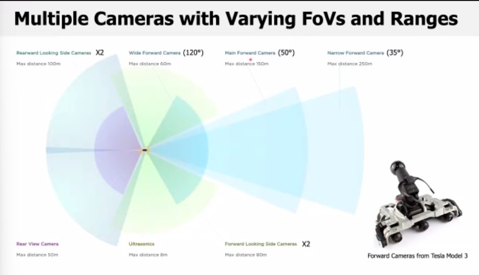

# 자율주행 특강
[국민대 김종찬 교수님]

# Autonomous Driving PipeLine

+ Perception
  + Camera
    + Camera-based Perception Task
      + Detect Object (DNN)
      + lane marking
      + drivalbe area
      + traffic lights
        
  + Lidar
  + Radar
  + Ultrasonic Sensors (range)
  + GNSS
  + IMU
  + Odometer
+ Tracking 
+ Prediction 
+ Localizaion 
+ Planning 
+ Control

## GPU (Graphics Processing Unit)
+ Applications requiring a hug amout of computations
+ OpenGL, and DirectX
+ Matrix MultiPlication
+ CPU는 시퀀스하게 하지만 GPU는 Parellel하게 연산한다. 
+ OPENCL
+ CUDA Language
+ GPU 수천개 수준에서 Parellel를 하는 것이 좋다.

### Accelerators
CPU가 연산을 다른 연산 장치에게 맡기는 것이다. 