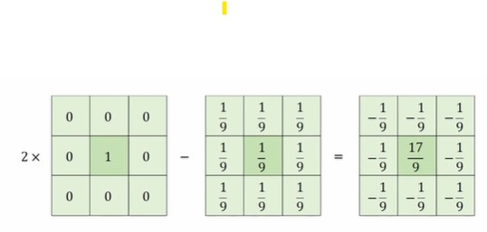

# 샤프닝

## 언샤프 마스크 필터링
날카롭지 않은 영상, 즉 블러링된 영상을 이용하여 날카로운 영상을 생성한다. 
+ Sharpness 조절을 위한 가중치값을 설정할 수 있다. 이 값을 통해서 언샤프 마스크 필터링의 정도를 조절할 수 있다.  
> OpenCV 에서는 sharping 하는 필터가 구현되어있지 않다. 


### Mean filter가 적용된 이미지의 언샤프 마스크 필터링
```cpp
Mat src = imread("rose.bmp", IMREAD_GRAYSCALE);

Mat blr;

blur(src, blr, Size(3, 3));

Mat dst = 2 * src - blr;

```

```cpp
float sharp_filter[] = {
    -1/9.f, -1/9.f, -1/9f,
    -1/9.f, 17/9.f, -1/9f,
    -1/9.f, -1/9.f, -1/9f,
};
```

> 직접 필터를 제작하는 것 보다 처음 소개한 코드가 더욱 더 좋은 품질의 샤프닝 필터링을 구현할 수 있다. 


### Guassian filter가 적용된 이미지의 언샤프 마스크 필터링
+ 입력 영상의 타입을 실수형으로 변환하여 연산한 것에 주의해야함!
```cpp
Mat srcf;
src.convertTo(srcf, CV_32FC1)
...
Mat blr;
GaussianBlur(srcf, blr, Size(), sigma);
float alpha = 1.0f;

# sharpen filter 처리 과정
Mat dst = (1.f + alpha) * srcf - alpha * blr;

dst.converTo(dst, CV_8UC1);

```
