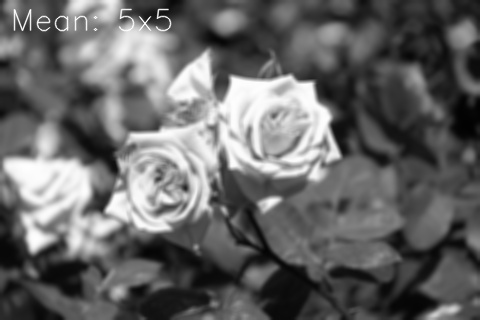

# 영상의 필터링

영상에서 필요한 정보만 통과시키고 원치 않는 정보는 걸러내는 작업
+ [블러링](#블러링)
+ 샤프닝
+ 잡음 제거
+ 에지 검출
+ 엠보싱 필터
  + 직물이나 종이, 금속판 등에 올록볼록한 형태로 만든 객체의 윤곽 또는 무늬를 처럼 보일 수 있도록 함
    

## 주파수 공간에서의 필터링
푸리에 변환을 이용하여 영상을 주파수 공간으로 변환하여 필터링을 수행하는 방법
+ 연산량이 상당히 많음
+ 저주파 공간 필터링 => 곱하기 연산
+ 역변환 => 블러링된 이미지를 얻을 수 있음
## 공간적 필터링

마스크를 통해 영상의 픽셀 값과 연산하여 필터링을 구한다. 
+ 다양한 모양과 크기의 마스크
  + 마스크는 다양한 크기, 모양을 지정할 수 있다. 
  + 대부분 3*3 정방형 필터를 사용한다. 
  + 마스크의 형태와 값에 따라 필터의 역할이 결정된다. 
    + 영상을 부드럽게 만들기 가능
    + 영상을 날카롭게 만들기 가능
    + 잡음 제거 가능
    + 에지 검출

### Convolution

+ 대각선으로 증가하는 그래프가 적용

### Cross-correlation

+ 대각선으로 감소하는 그래프가 적용

> 영상처리에서는 Correlation이 공간적 필터링을 연산하는 것을 의미하지만 관용적으로 Convolution라고도 한다. 

#### 최외각 픽셀 처리
입력 영상의 최외각 자리에서 필터 연산을 처리하는 데 문제가 발생한다. 
해당 위치에서 해당 픽셀이 위치하지 않기 때문에 연산을 하지 못하는 문제가 발생한다. 
+ OpenCV에서는 가상의 픽셀을 만들어서 연산을 한다. 
+ 0으로 설정하거나 픽셀 위치의 해당 위치의 픽셀값을 넣을 수 있다. 
+ 대칭적으로 나타날 수 있도록 표현한다. 
    


##### 가장자리 픽셀 확장 방법
> OpenCV 필터링에서 지원하는 가장자리 픽셀 확장 방법
+ BorderTypes 열거형 상수
  + BORDER_CONSTANT ➡ 가장자리가 0으로 지정
  + BORDER_REPLICATE ➡ 가장자리와 같은 픽셀로 지정
  + BORDER_REFLECT ➡ 해당 지점과 대칭적으로 지정
  + BORDER_REFLECT_101(default, BORDER_REFECT101)

+ 필터링을 진행할 때 가장자리 픽셀을 확장하는 함수
```cpp
void copyMakeBorder(InputArray src, OutputArray dst,
                                 int top, int bottom, int left, int right,
                                 int borderType, const Scalar& value = Scalar() );
```

+ 파라미터
  + src: 입력영상
  + dst: 출력영상
  +  확장할 픽셀 크기
     + top: 윗쪽 확장 크기
     + bottom: 아래쪽 확장 크기
     + left: 왼쪽 확장 크기
     + right: 오른쪽 확장크기
  + boarderType: 가장자리 픽셀 확장 방법
  + value => Border_ConSTANT 일때 사용할 값

> 직접 호출해서 사용되는 경우는 없지만 Opencv내 필터링 연산에 사용되는 함수이다. 


### 기본적인 2D 필터링 함수
```
void filter2D( InputArray src, OutputArray dst, int ddepth,
                            InputArray kernel, Point anchor = Point(-1,-1),
                            double delta = 0, int borderType = BORDER_DEFAULT );
```
+ 파라미터
  + src: 입력 영상
  + dst: 출력 영상
  + ddepth: 원하는 결과 영상의 깊이를 지정 -1이면 src와 같은 깊이를 사용
  + Kernel: 필터 마스크 행렬, 1채널 실수형
  + delta: 추가적으로 더할 값
  + borderType: 가장자리 픽셀 처리 방법


# 블러링

## 평균 값 필터 (mean filter)
각각의 좌표에서 주변 픽셀 값들의 산술 평균을 계산하고 이를 출력 영상의 픽셀 값으로 설정한다. 날카로운 에지가 무뎌지고 영상에 있는 잡음이 감소하는 효과가 있다. 

```cpp
Mat kernel = Mat::ones(3, 3, CV_32FC1) / 9.f;
Mat dst;

filter2D(src, dst, -1, kernel);

```
+ 경우에 따라 3*3보다 더 큰 필터를 사용할 수 있다. 
+ 단점
  + 필터링 대상 위치에서 가까이 있는 픽셀과 멀리 있는 픽셀이 모두 같은 가중치를 사용하여 평균을 계산하므로, 현재 위치의 픽셀 값의 비중은 줄어들고, 상대적으로 멀리 떨어져 있는 픽셀들의 영향이 커진다. 
> 이러한 단점을 해결하기 위해서 정규분포 즉 가우시안 함수를 사용한다. 

[가우시안필터](##가우시안필터)

> 마스크 크기가 커질수록 평균 값 필터의 결과가 더욱 부드러워진다. 하지만 더 많은 연산량이 필요하다. 

### 평균 값 필터를 이용한 블러링 함수
```cpp
void blur( InputArray src, OutputArray dst,
                        Size ksize, Point anchor = Point(-1,-1),
                        int borderType = BORDER_DEFAULT );
```

+ 파라미터
  + src: 입력 영상
  + dst: 출력 영상
  + ksize: 평균값 필터 크기
  + anchor: 고정점
  + borderType: 가장자리 픽셀 확장 방식

#### 사용예시
```cpp
#include <iostream>
#include "opencv2/opencv.hpp"

using namespace std;
using namespace cv;

int main()
{
	Mat src = imread("rose.bmp", IMREAD_GRAYSCALE);
	string path = "D:/devcourse/ROS_Practice/note/OpenCV/영상의 필터링/img/blur";
	if (src.empty()) {
		cerr << "Image load failed!" << endl;
		return -1;
	}

	imshow("src", src);

	Mat dst;
	for (int ksize = 3; ksize <= 7; ksize += 2) {
		blur(src, dst, Size(ksize, ksize));

		String desc = format("Mean: %dx%d", ksize, ksize);
		putText(dst, desc, Point(10, 30), FONT_HERSHEY_SIMPLEX, 1.0, 
			Scalar(255), 1, LINE_AA);

		imshow("dst", dst);
		
		string filename = path + to_string(ksize) + ".jpg";
		imwrite(filename, dst);
		waitKey();
	}
}

```





## 가우시안필터
```cpp
void GaussianBlur( InputArray src, OutputArray dst, Size ksize,
                                double sigmaX, double sigmaY = 0,
                                int borderType = BORDER_DEFAULT );
```

+ 파라미터
  + src: 입력 영상 ( 각 채널 별로 처리됨)
  + dst: 출력 영상, src와 같은 크기, 같은 타입을 가진다. 
  + ksize: 가우시안 커널 크기
  + sigmaX: x방향 sigma
  + sigmaY: y방향 sigma
  + borderType: 가장자리 픽셀처리방식