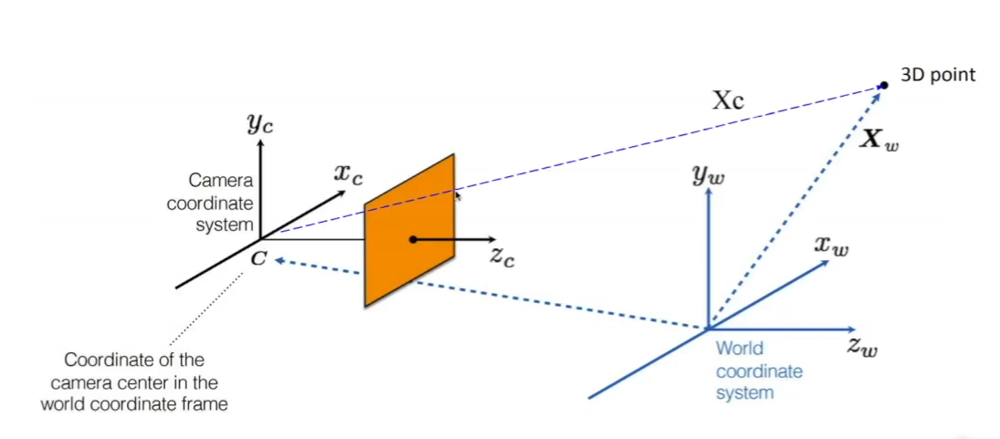
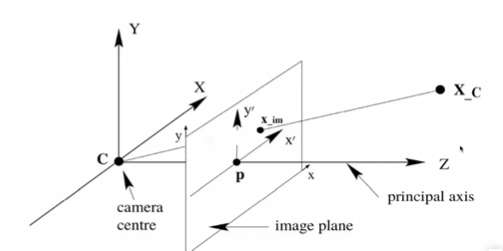

Camera Obsura(바늘 구멍 카메라)
+ 이 바늘구멍 카메라는 빛의 물리적 현상을 이용했다.
+ 이미지에 맻힌 상이 거꾸로 있는 것 또한 빛의 물리적 현상이다.
+ 그리고 2D 공간인 하나의 상으로 맺힌다는 것을 인지하고 있었다.

Modern Camera
+ 빛에 대한 제어는 하드웨어, 소프트웨어로 조작
+ 빛을 모으는 역할은 렌즈가 그 역할을 함

> 하지만 두가지 카메라는 원리가 같다.

# Camera Projection

World 좌표계에서 카메라 좌표계로 변환하고 이후에 이미지 좌표계로 변환한다.
> 이 과정 속에서 카메라의 이미지 상 맺힘이 일어난다.

## World2Camera
두 좌표계는 3D 좌표계이며, RIGID Body Motion 으로 표현할 수 있다.

+ World 상에 있는 좌표에 대한 정보는 Rigid Body motion으로 표현할 수 있기 때문에 다음과 같이 표현한다.
  + Rotation은 3*3matrix (SO(3))를 사용하며
  + Translation은 3*1 Vector를 사용해 표현할수있고
+ 변환 매트릭스는 4*4 matrix를 사용한다. (SE(3))

## Camera2Image

 닮은 꼴 삼각형을 이용하여 좌표를 구할 수 있다. 