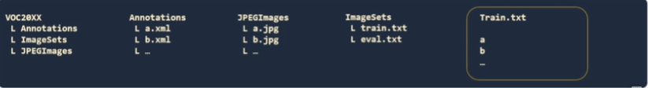
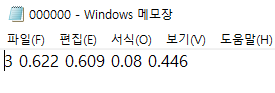

# YOLOv3

## Architecture

## Make model using cfg(config) file
config 파일을 이용하여 모델을 생성한다. 
+ hyperprameters
+ Model architecture
+ Data aughmentation
+ Input resolution
+ ...

여러가지 정보들이 담겨있다. 

## Annotation & configuration

### YOLO format
+ YOLODATA
  + Train
    + a.jpg
    + a.txt
    + b.jpg
    + b.txt
    + ...
  + Eval
  + Test
+ train.list
  + YOLODATA/Train/a.jpg
  + ...
+ eval.list
  + YOLODATA/Eval/c.jpg
  + ...

+ PASCAL VOC FORMAT

## Annotation labeling format

YOLO labeling format은 다음과 같다
+ Class_index
+ x_center
+ y_center
+ width
+ height
> x, y, w, h의 값들은 0, 1사이의 값으로 정규화되어있다. 
> 이번 YOLOv3 구성에서는 Annotation에서 XML 형식은 사용하지 않는다. 

## Dataset
Dataset으로는 KITTI dataset을 사용 할 예정이다.

### Converting label format from KITTI to YOLO

**KITTI format**
Pedestrian 0.00 0 -0.20 ... 8.41, 0.01

**YOLO format**
3 0.622 0.609 0.08 0.446

> Convert Code를 이용하여 전환해줄 예정.

